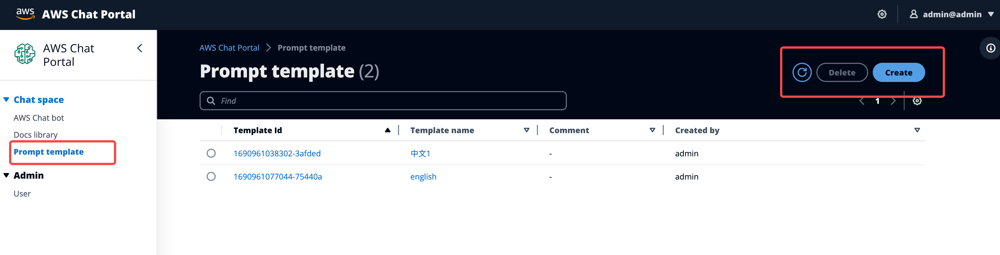
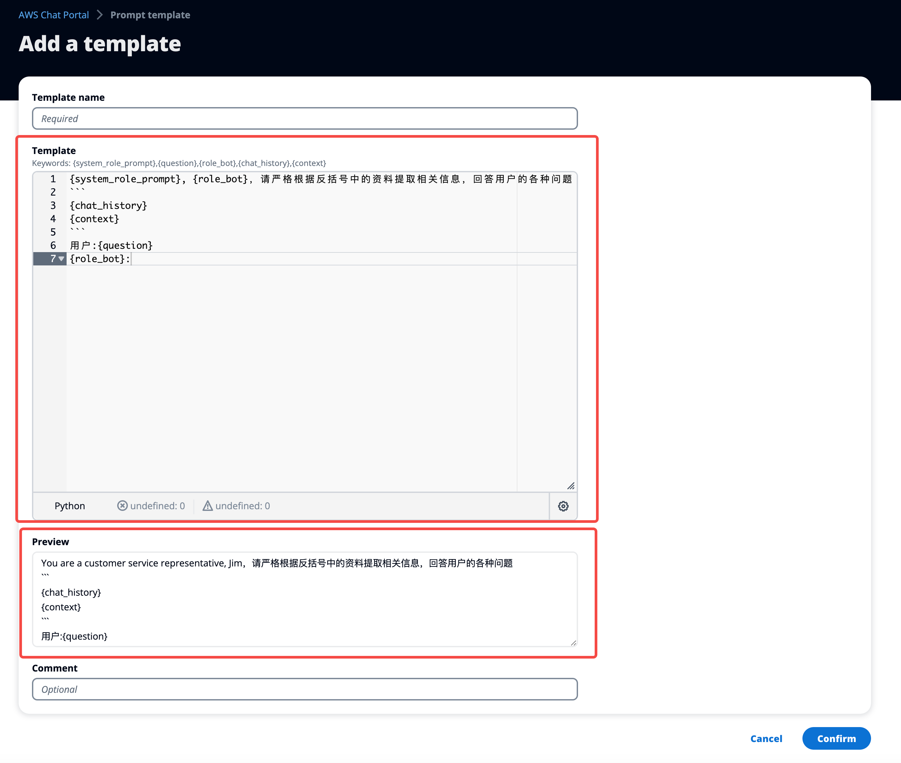
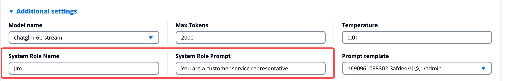
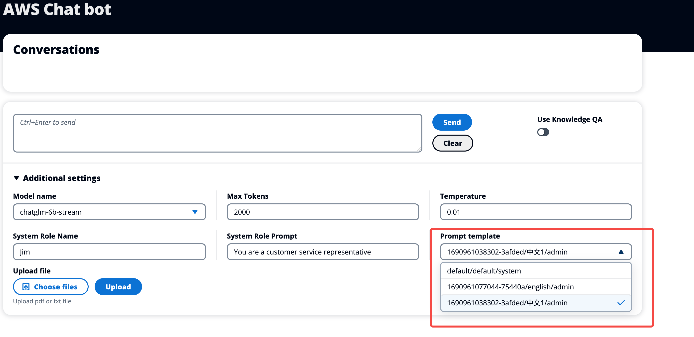

# How to use prompt template

## 1.Why need prompt template?  
Considering different LLM models might require different instruction format for their prompt input, and users might also needs multi-language support, thus we release a feature for customizing the LLM prompt template which allows the users can create their own template, and select the template when chat with the bot.  

## 2.How to find it?
You can find it in the side nav bar, where you can see all the customized templates and view, delete, or create a new one.

## 3.How to create a template?
You will see an example when you create a template firstly. and you must use the exact keywords {system_role_prompt},{question},{role_bot},{chat_history},{context} in your template. and those keywords will be replaced accordingly when the generate the final prompt input to LLM. You also can preview the result in prevew section.  

 ### **Notes**
1. **{system_role_prompt}** and **{role_bot}** will be replaced by the "System Role Prompt" and "System Role Name" in the addiontional setttings in the chat panel.  

2. **{question}** will be replaced by the user question.  
3. **{context}** will be replaced by the recalled knowledge.
4. **{chat_history}** will be replaced by history conversation (Not available now, but please KEEP it in case mutli-round conversation will be opened in future).  

## 4. How to use a template?  
You can select the template in the additional settings panel
