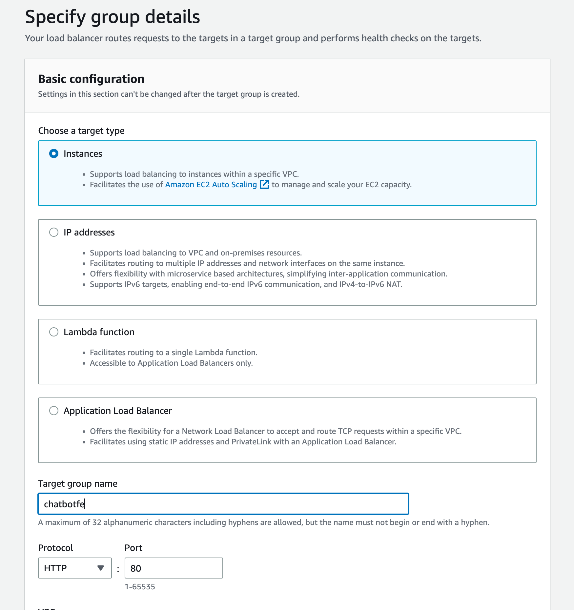
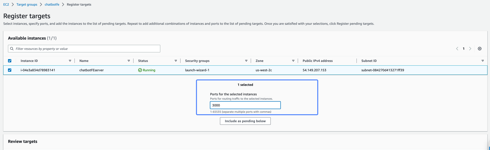
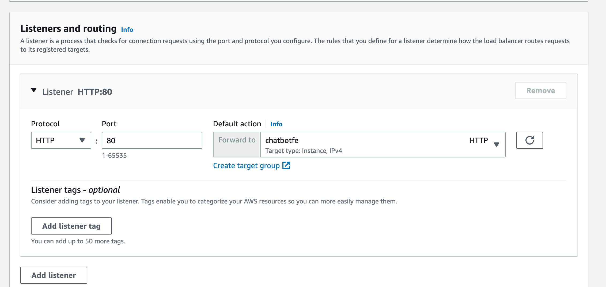
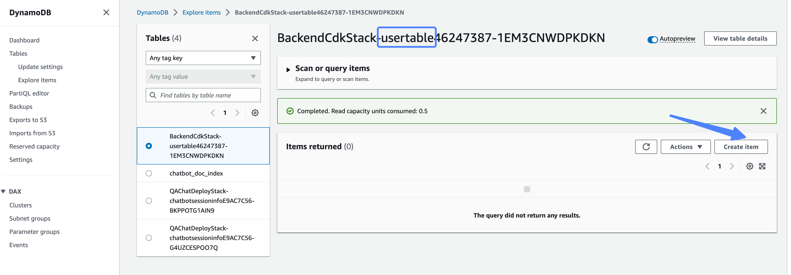
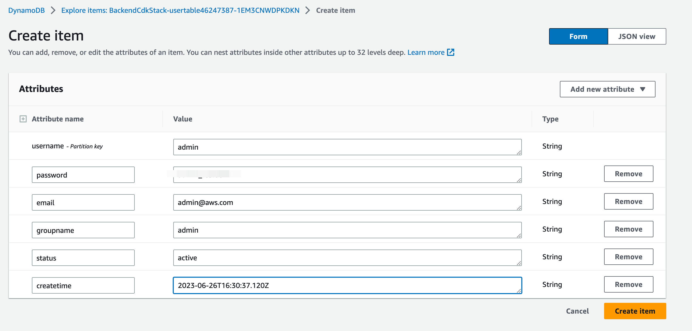
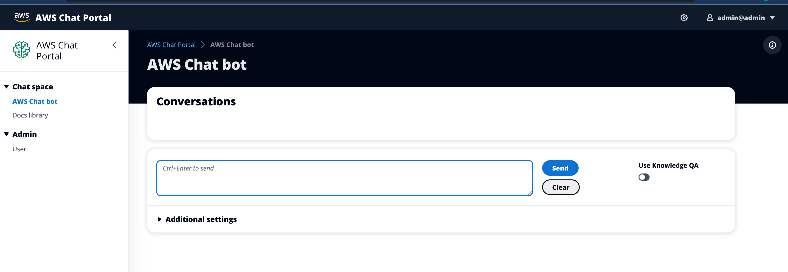
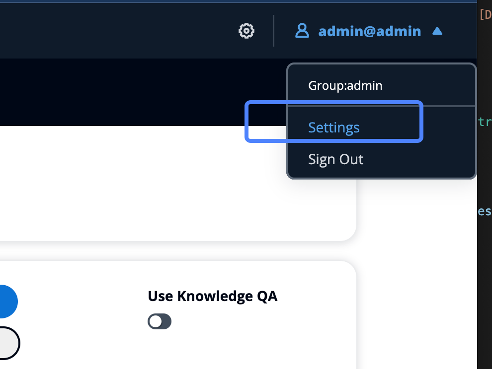

# How to deploy on EC2  
## Create an ec2 server from AWS console,
select unbuntu 22.04 linux  
please open ports 80 and 3000 for the security group
## Login in ec2 server and download code  
`git clone https://github.com/xiehust/chatbotFE.git`  
change .env.sample to .env and change the API_http and API_socket from to your CDK deployment result  

## Install nodejs and yarn
`curl -sL https://deb.nodesource.com/setup_18.x | sudo -E bash -`  
`sudo apt-get install -y nodejs`  
`sudo npm install yarn -g`  

## Build files  
`cd ~/chatbotFE`   
`yarn install`  
`yarn build`  

## Install PM2, which is a daemon process manager that will help you manage and keep your application online 24/7. Let's install it.  
`sudo yarn global add pm2`  
`cd ~/chatbotFE`  
`pm2 start yarn --name "chatbotFE" -- start`  
### Once App is started, running would yeild pm2 list  
`pm2 list`  
### In order to start pm2 on system reboot add the following:  
`pm2 startup systemd`    

## Setup ALB  
### Create instances target group, choosing the ec2 created above as the target, and register port 3000   
  
  
### Create Application Load Balancer using the target group above, and choose the same security group as ec2  
  

## Go the dynamodb and create a admin account  
  
### data fields samples
username:yourname  
password:yourpassword   
email:youremail@xx.com  
groupname:admin  
status:active  
createtime:2023-06-26T16:30:37.120Z   
  
## Visit the dns of ALB, and login you are supposed to see the pages   
  

## Click settings to complete settings  
